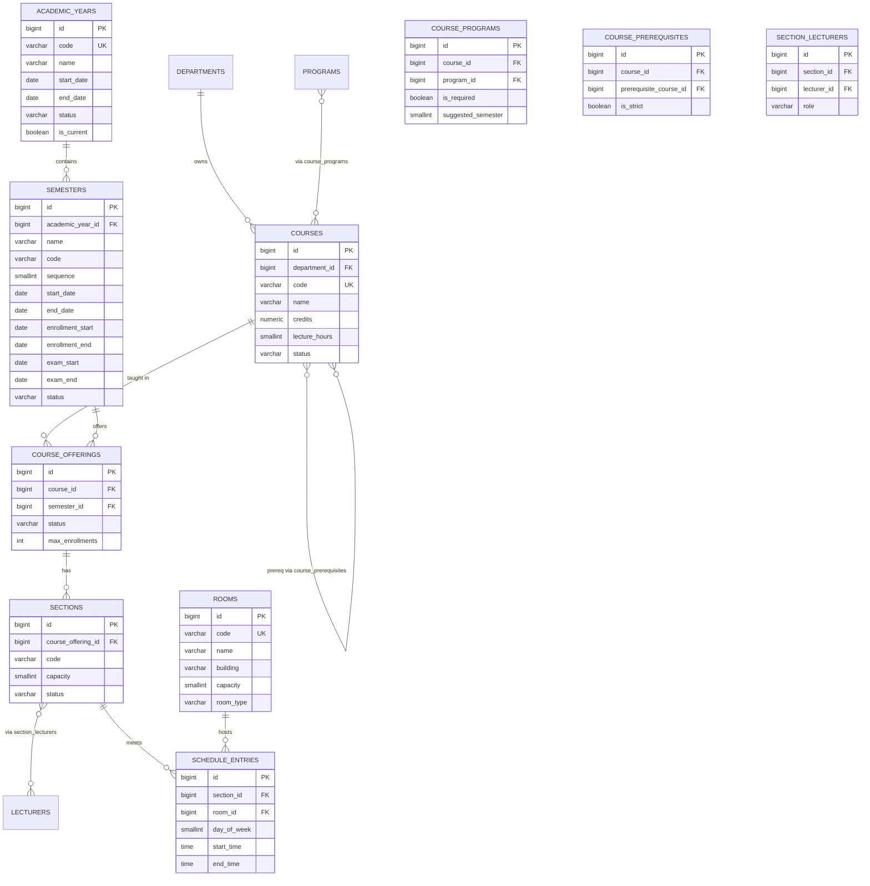

# ERD — Academic Management

Calendar, courses, prerequisites, offerings, sections, schedule, rooms,
lecturer assignments.

Notes:

- Offering = course × semester (UQ `(course_id, semester_id)`).
- Schedule: recurring weekly slots; conflict backstops in DB (section/room),
  partial-overlap & lecturer checks in `TimetableService`.
- One primary lecturer per section (partial unique index on
  `section_lecturers`).