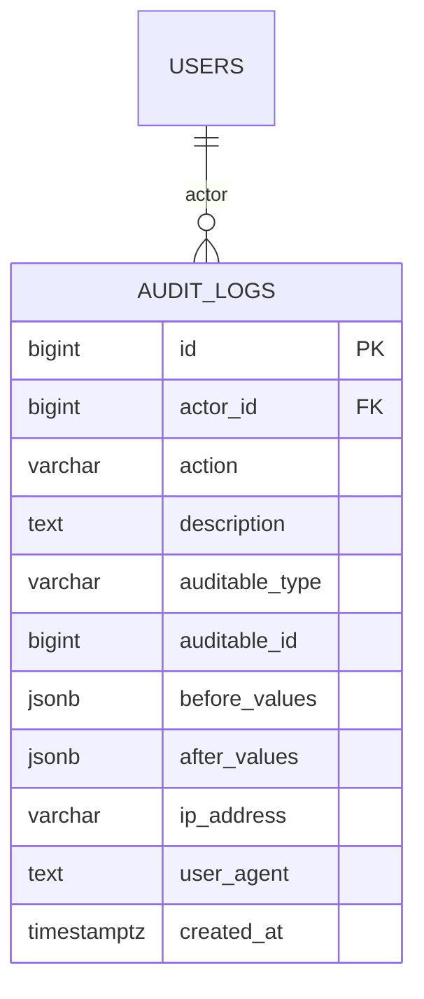

# ERD — Audit

Append-only audit trail.

Notes:

- `before_values` / `after_values` are JSONB snapshots of the rows before/after
  a change — the sanctioned JSONB use case (see `database-conventions.md`).
- `actor_id` is nullable (`?bigint`) because system/cron changes have no actor.
- Target record is optional and polymorphic via
  `auditable_type` / `auditable_id` (no FK on the pair).
- Never cleaned at runtime; archive via a nightly job if retention is needed.