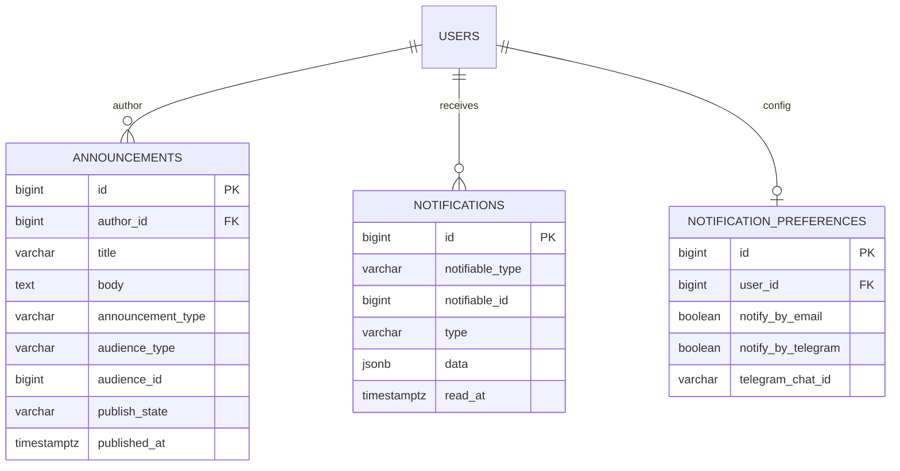

# ERD — Communication

Announcements and the polymorphic notification inbox.

Notes:

- `notifications` mirrors Laravel's polymorphic notification contract
  (`notifiable_type` / `notifiable_id`) so queued notifications plug straight
  into Eloquent.
- `notifications.data` is a JSONB payload (see `database-conventions.md`).
- `announcements.audience_type` is a `varchar` + `CHECK`:
  `all|students|lecturers|staff|faculty|department|program|section|course`;
  `announcement_type` is `general|academic|administrative|event`;
  `publish_state` is `draft|published|archived`.
- Announcement attachments are `files` rows with `fileable` pointing at the
  announcement.