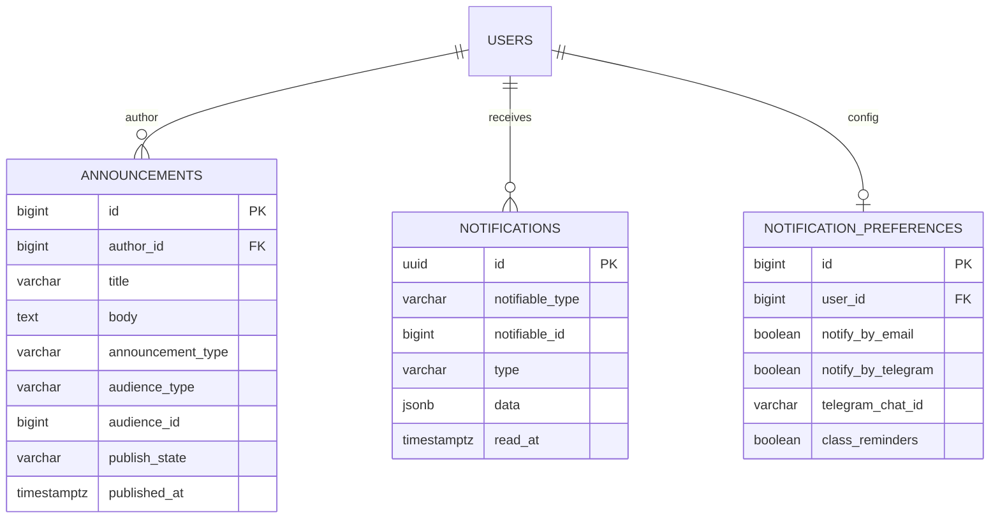

# ERD — Communication

Announcements and the polymorphic notification inbox.

```mermaid
erDiagram
    USERS ||--o{ ANNOUNCEMENTS : "author"
    USERS ||--o{ NOTIFICATIONS : "receives"
    USERS ||--o| NOTIFICATION_PREFERENCES : "config"

    ANNOUNCEMENTS {
        bigint id PK
        bigint author_id FK
        varchar title
        text body
        varchar announcement_type
        varchar audience_type
        bigint audience_id
        varchar publish_state
        timestamptz published_at
    }
    NOTIFICATIONS {
        uuid id PK
        varchar notifiable_type
        bigint notifiable_id
        varchar type
        jsonb data
        timestamptz read_at
    }
    NOTIFICATION_PREFERENCES {
        bigint id PK
        bigint user_id FK
        boolean notify_by_email
        boolean notify_by_telegram
        varchar telegram_chat_id
        boolean class_reminders
    }
```

Notes:

- `notifications` mirrors Laravel's polymorphic notification contract
  (`notifiable_type` / `notifiable_id`) so queued notifications plug straight
  into Eloquent.
- `notifications.data` is a JSONB payload (see `database-conventions.md`):
  `kind`, `title`, `body`, `url`, rendered when the notification is sent. The
  key is a UUID (generated by Laravel's database channel) since report 42,
  which turned the table into the in-app inbox; rows older than 180 days are
  pruned daily.
- `announcements.audience_type` is a `varchar` + `CHECK`:
  `all|students|lecturers|staff|department|program|section|course` (`faculty` dropped from the CHECK by `2026_10_05_170000`, report 39 §7);
  `announcement_type` is `general|academic|administrative|event`;
  `publish_state` is `draft|published|archived`.
- Announcement attachments are `files` rows with `fileable` pointing at the
  announcement.