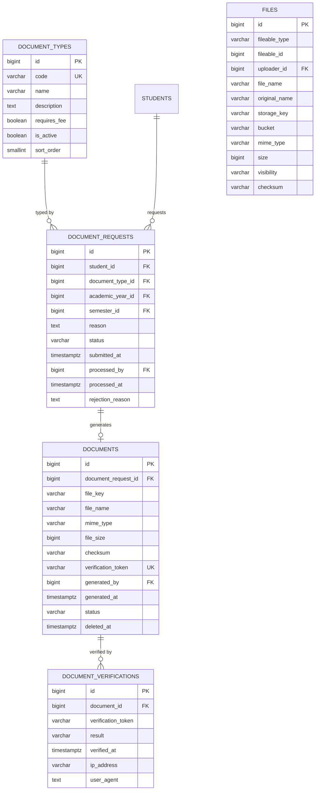

# ERD — Documents

Document types, requests, generated documents, verifications, and the
polymorphic file storage table.

Notes:

- `files` is polymorphic (`fileable_type` / `fileable_id`) — attachments to
  assignments, submissions, internship reports, and announcements. No FK on
  the polymorphic pair.
- `documents` stores its own `file_key`/`file_name`/`checksum` because a
  generated document is a discrete artifact, not a generic upload
  (see `data-dictionary.md`).
- `verification_token` is the unique human-visible key used on the public
  verification page; verification attempts append to
  `document_verifications`.
- Documents are soft-deleted, never hard-purged, to preserve verification
  history.