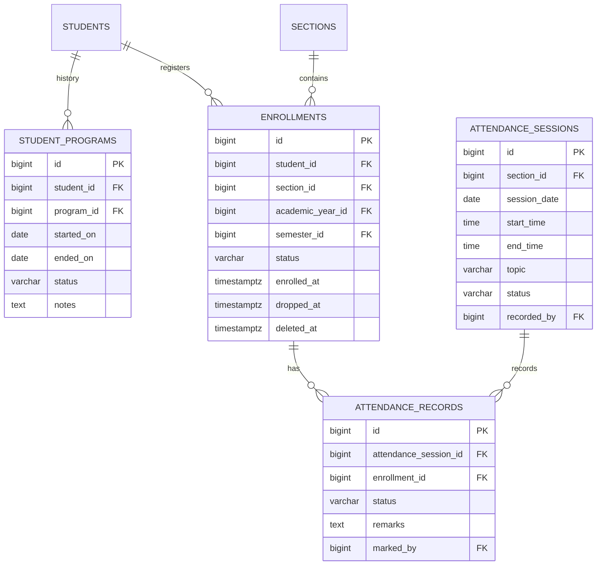

# ERD — Enrollment & Attendance

Student enrollment into sections, program history, attendance sessions and
per-student records.

Notes:

- `enrollments` has a unique `(student_id, section_id)` pair plus snapshot
  FKs to `academic_year_id` / `semester_id` so historical reports survive
  calendar edits.
- Soft delete is enabled on `enrollments`.
- Statuses: enrollment `pending|confirmed|completed|dropped|withdrawn`;
  attendance session `scheduled|held|cancelled`; attendance record
  `present|absent|late|excused`.
- `student_programs` enforces exactly one active program per student (partial
  unique index).
- `attendance_sessions` is unique per `(section_id, session_date)`.