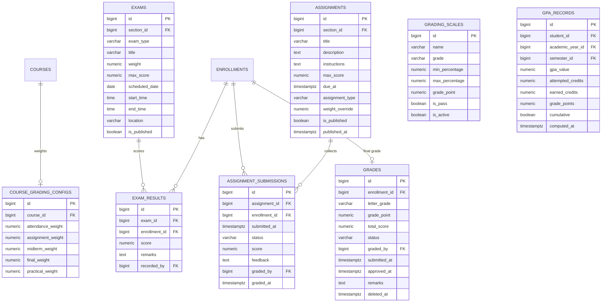

# ERD — Examination & Grading

Exams, results, final grades, grading scales, GPA records, and per-course
grading configuration. Includes assessment tables (assignments).

Notes:

- `grading_scales` holds one row per letter band of the configurable scale
  (default A/B+/B/C+/C/D/F → 4.0 / 3.5 / 3.0 / 2.5 / 2.0 / 1.0 / 0.0) with
  `is_pass` flagging passing bands.
- GPA is stored only as recomputed snapshots in `gpa_records` — it is never
  kept in a pre-aggregated live column.
- `grades` is soft-deletable and carries an approval workflow
  (`draft|submitted|approved|finalized`) with `graded_by`.
- `course_grading_configs` weights must sum to 100 (DB CHECK).
- Assessment tables (`assignments`, `assignment_submissions`) belong to the
  Assessment module but are shown here because they feed the same grading
  pipeline.