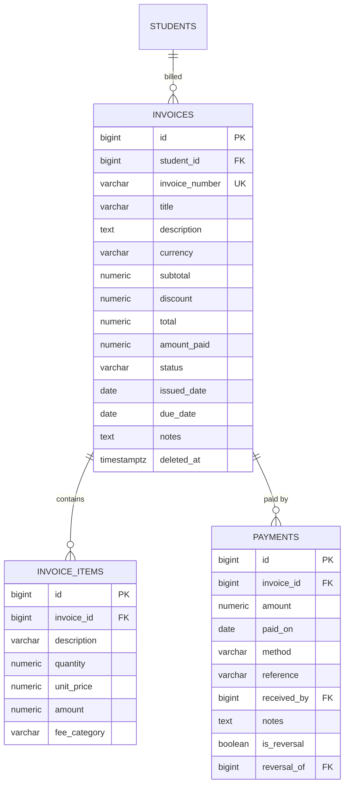

# ERD — Finance

Invoices, line items, and append-only payments.

Notes:

- Payments are append-only: reversals are new rows with `is_reversal = true`
  pointing at the original via `reversal_of`; nothing is updated or deleted.
- `invoice_number` is a business-friendly, human-readable unique identifier
  (the `reference` on a payment is informational, not unique).
- `invoices.amount_paid` is a derived running total (≤ `total`), maintained
  transactionally by the invoice service.