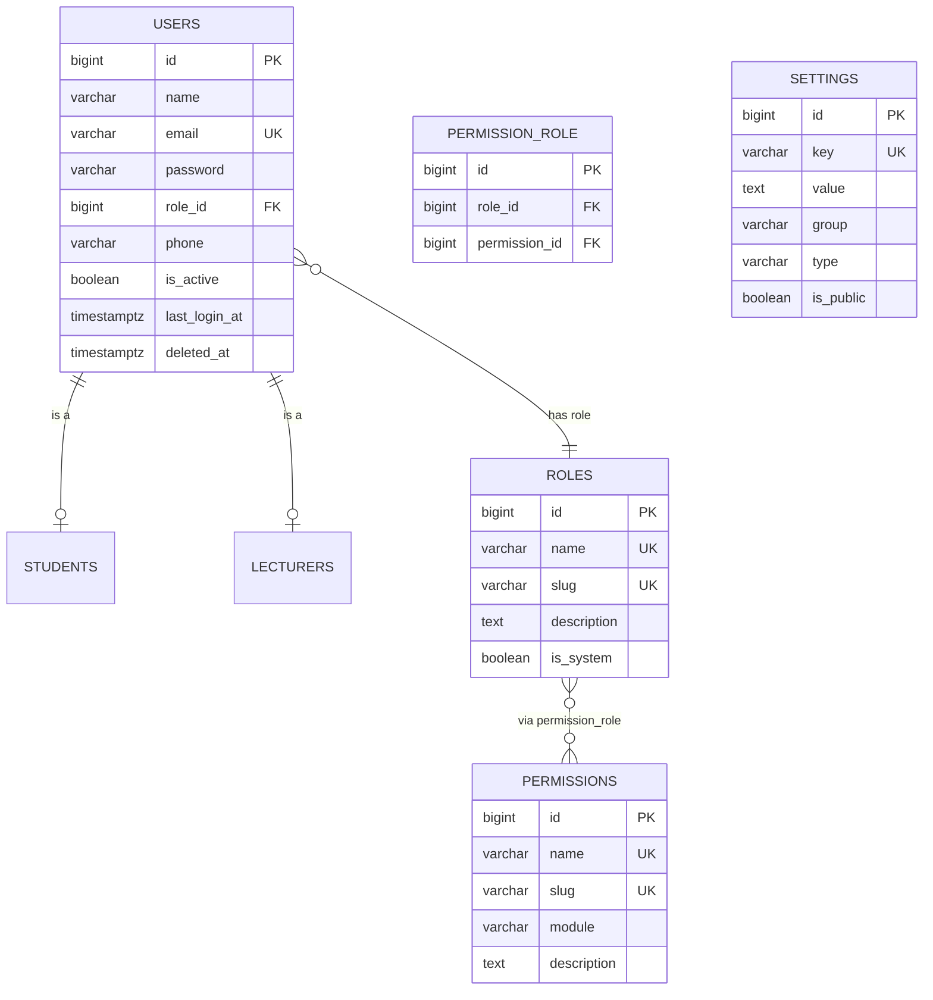

# ERD — Identity & Access

Users, roles, permissions, RBAC pivot, and system settings.

Notes:

- One role per user in the MVP (see `decisions.md` §6).
- A user may also be a student OR a lecturer (never both).
- `settings` is a key-value store for institution configuration.