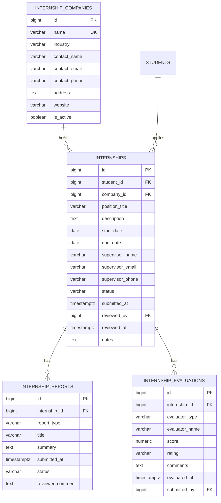

# ERD — Internship

Companies, internship placements, reports, and evaluations.

Notes:

- Company records are lean (no opportunity catalog) — see `decisions.md` §10.
- `internships` enforces one open application per student (partial unique
  index) across `submitted|under_review|approved|in_progress`.
- Evaluations are typed `supervisor|faculty` with a free-text `evaluator_name`;
  `score` is 0–100 (unsigned CHECK) — no polymorphic FK in the MVP
  (see `decisions.md` §4).
- Reports attach their rendered file via the polymorphic `files` table.