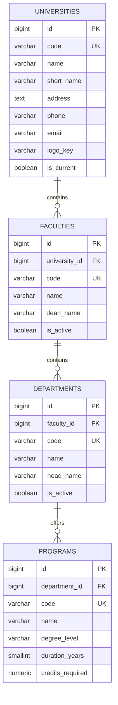

# ERD — University Structure

The institutional hierarchy root: university → faculty → department → program.

Notes:

- `is_current` marks the active institution row.
- Deleting a faculty/department/program is `RESTRICT` (must be empty first).