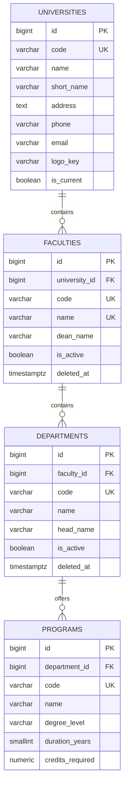

# ERD — University Structure

The institutional hierarchy root: university → faculty → department → program.

```mermaid
erDiagram
    UNIVERSITIES ||--o{ FACULTIES : "contains"
    FACULTIES ||--o{ DEPARTMENTS : "contains"
    DEPARTMENTS ||--o{ PROGRAMS : "offers"

    UNIVERSITIES {
        bigint id PK
        varchar code UK
        varchar name
        varchar short_name
        text address
        varchar phone
        varchar email
        varchar logo_key
        boolean is_current
    }
    FACULTIES {
        bigint id PK
        bigint university_id FK
        varchar code UK
        varchar name UK
        varchar dean_name
        boolean is_active
        timestamptz deleted_at
    }
    DEPARTMENTS {
        bigint id PK
        bigint faculty_id FK
        varchar code UK
        varchar name
        varchar head_name
        boolean is_active
        timestamptz deleted_at
    }
    PROGRAMS {
        bigint id PK
        bigint department_id FK
        varchar code UK
        varchar name
        varchar degree_level
        smallint duration_years
        numeric credits_required
    }
```

Notes:

- `is_current` marks the active institution row. Exactly one university may hold
  the flag; `UniversityService::makeCurrent()` clears the previous row.
- `faculties.name` is globally unique (`uq_faculties_name`) so a dean name is
  unambiguous across the whole institution.
- `departments` is unique per faculty (`uq_departments_faculty_id_name`), not
  globally — the same subject department name may exist under two faculties.
- `faculties` and `departments` carry `deleted_at`. Archiving flips
  `is_active`; soft deleting is reserved for removal once programs, courses or
  lecturers reference the row.
- `universities` deliberately has no `deleted_at` — it is reference data with
  an `is_current` flag, not archivable history.
- Deleting a university/faculty is `RESTRICT` (must be empty first), and the
  guard counts soft-deleted children too, so an archived faculty still blocks
  deleting its university.