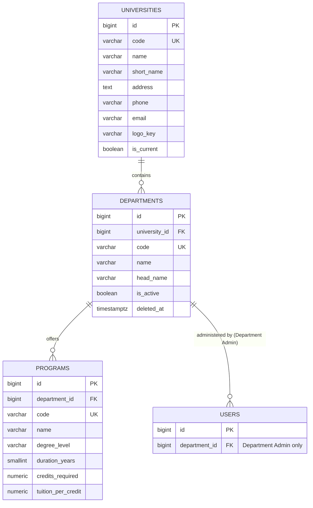

# ERD — University Structure

The institutional hierarchy root: university → department → program. The
faculty level was removed in report 39
(`docs/39_Department-Only-Structure-Report.md`).

```mermaid
erDiagram
    UNIVERSITIES ||--o{ DEPARTMENTS : "contains"
    DEPARTMENTS ||--o{ PROGRAMS : "offers"
    DEPARTMENTS ||--o{ USERS : "administered by (Department Admin)"

    UNIVERSITIES {
        bigint id PK
        varchar code UK
        varchar name
        varchar short_name
        text address
        varchar phone
        varchar email
        varchar logo_key
        boolean is_current
    }
    DEPARTMENTS {
        bigint id PK
        bigint university_id FK
        varchar code UK
        varchar name
        varchar head_name
        boolean is_active
        timestamptz deleted_at
    }
    PROGRAMS {
        bigint id PK
        bigint department_id FK
        varchar code UK
        varchar name
        varchar degree_level
        smallint duration_years
        numeric credits_required
        numeric tuition_per_credit
    }
    USERS {
        bigint id PK
        bigint department_id FK "Department Admin only"
    }
```

Notes:

- `is_current` marks the active institution row. Exactly one university may hold
  the flag; `UniversityService::makeCurrent()` clears the previous row.
- `departments` is unique per university (`uq_departments_university_id_name`);
  when the faculty level was removed, a name two faculties shared got its code
  appended instead of failing the migration.
- `users.department_id` scopes a Department Admin to one department
  (`fk_users_department`, SET NULL — deleting the department unassigns them).
- `departments` carries `deleted_at`. Archiving flips `is_active`; soft deleting
  is reserved for removal once programs, courses or lecturers reference the row.
- `universities` deliberately has no `deleted_at` — it is reference data with
  an `is_current` flag, not archivable history.
- Deleting a university is `RESTRICT` (must be empty first), and the guard
  counts soft-deleted departments too, so an archived department still blocks
  deleting its university.
