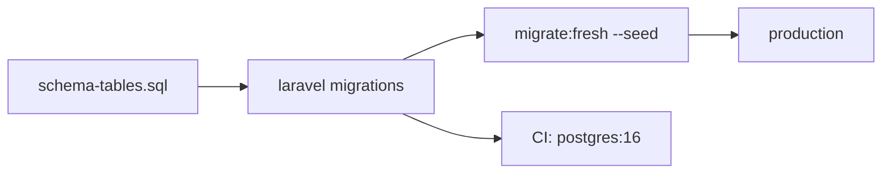

# EduCore Database Migration Strategy

How the `schema-tables.sql` schema (49 domain tables + 8 framework tables)
will be brought into existence and evolved.

## Scope

- PostgreSQL 16, single database, tenant-per-installation (no multi-tenant
  columns; see `decisions.md` §12).
- This document covers the **Laravel migration pipeline** that replaces the
  v1 bootstrap SQL. It does not redefine the schema itself — see
  `schema-reference.md` / `schema-tables.sql`.

## 1. Pipeline

1. `backend/database/migrations/*.php` are the single source of truth for the
   live schema (SQL file serves as readable documentation / bootstrap).
2. Batch order below respects foreign-key dependencies; Laravel runs batches
   sequentially within a single `migrate`.
3. Seeding uses `db:seed` (see `seed-strategy.md`).

## 2. Migration order

Tables are authored in this dependency order (child tables come only after
the FKs they reference):

| Step | Batch | Tables | Depends on |
|---|---|---|---|
| 0 | 00_framework | plus framework tables (`password_reset_tokens`, `sessions`, `cache`, `cache_locks`, `jobs`, `job_batches`, `failed_jobs`, `personal_access_tokens`) | (none) |
| 1 | 01_identity | `roles`, `permissions`, `permission_role`, `settings` | — |
| 2 | 02_users | `users` | roles |
| 3 | 03_university | `universities`, `faculties`, `departments`, `programs` | — |
| 4 | 04_academic_years | `academic_years`, `semesters` | — |
| 5 | 05_academic | `courses`, `course_programs`, `course_prerequisites`, `rooms`, `lecturers` | departments, programs, users |
| 6 | 06_offerings | `course_offerings`, `sections`, `section_lecturers`, `schedule_entries` | courses, semesters, lecturers, rooms |
| 7 | 07_students | `students`, `student_programs` | users, programs, academic_years, semesters |
| 8 | 08_enrollment | `enrollments` | students, sections, academic_years, semesters |
| 9 | 09_attendance | `attendance_sessions`, `attendance_records` | sections, enrollments |
| 10 | 10_assessment | `assignments`, `assignment_submissions` | sections, enrollments |
| 11 | 11_exams | `exams`, `exam_results`, `grading_scales`, `course_grading_configs`, `grades`, `gpa_records` | sections, enrollments, courses, academic_years, semesters |
| 12 | 12_files | `files` | (polymorphic, no FK) |
| 13 | 13_documents | `document_types`, `document_requests`, `documents`, `document_verifications` | students, files, users |
| 14 | 14_finance | `invoices`, `invoice_items`, `payments` | students, users outside batch |
| 15 | 15_communication | `announcements`, `notifications`, `notification_preferences` | users |
| 16 | 16_internship | `internship_companies`, `internships`, `internship_reports`, `internship_evaluations` | students, files |
| 17 | 17_audit | `audit_logs` | users |

Total migrations ≈ 57 table files (+ index/seed support files). Each migration
defines columns, named constraints, and indexes exactly as in
`schema-reference.md`.

> Note: `users` intentionally comes early (step 2) because lecturers and
> students are profiles over the same `users` row.

## 3. Down / rollback

- All tables are `dropIfExists`-friendly **in reverse dependency order**;
  `migrate:rollback` walks batches backwards.
- Soft-delete tables (`enrollments`, `grades`, `documents`, `invoices`) keep a
  `deleted_at` column — rollback of a whole schema still requires `refresh`
  since indexes/uniques must drop with tables.

## 4. Status changes (forward-only migrations)

- Never edit an already-shipped migration. Schema evolution is additive:
  new table → new migration file; new column → `nullable`/`default`-backed;
  new status value → update `CHECK` via fresh migration with
  `dropConstraint + addConstraint`.
- Status transitions are application-enforced (state machine per module
  service), not DB triggers.
- JSONB payload columns are append-only; no migration needed when shape
  changes.

## 5. Verification checklist (per module skill)

Before `migrate:fresh --seed` is accepted: every table present (SQL + adminer
count), every constraint name unique, no orphan FKs, partial unique indexes
compiled, seed run idempotent (`refresh` twice → same state).